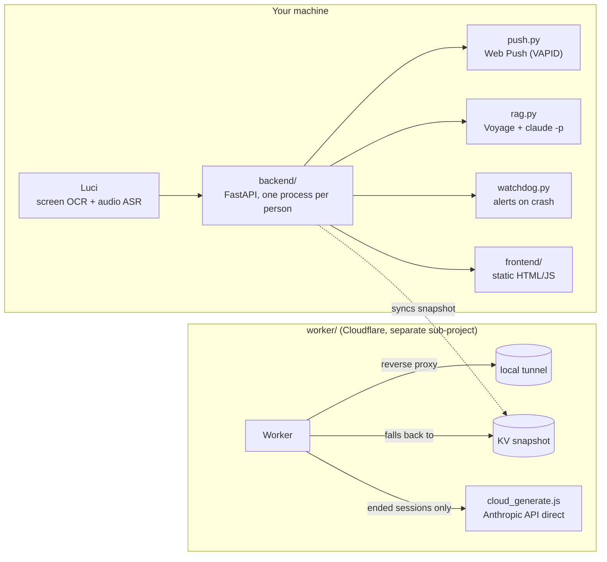

# 🏎️ F1 Race Analysis

**Point it at any live F1 broadcast. It watches the screen, listens to the commentary, and tells you what's actually happening — pit stops, safety cars, lead changes, strategy — in real time, with an LLM doing the explaining.**

No official timing feed, no scraping a paid API: just dual-stream perception (screen OCR + audio ASR) fed into an LLM analysis pipeline. Built as a test of that methodology first, grew into a tool people actually use to follow races.

[](pyproject.toml)
[](backend/app.py)
[](LICENSE)

Built on [Luci](https://luci.so), the on-device screen/audio memory engine from [memories.ai](https://memories.ai/) — the team NVIDIA partnered with at GTC 2026 (Cosmos Reason 2 + Metropolis) to bring persistent visual memory to robots and wearables.

<!-- TODO: drop a demo GIF or short screen recording here — this is the single highest-leverage thing missing from this README. Record ~15s of a live session: the event timeline populating + an LLM-generated commentary line appearing. -->

## What it does

- **Detects a live race from the screen alone.** No platform integration — if `LAP 12/70` is visible on screen (Bilibili, YouTube, whatever), it's recognized as a live F1 session and recording starts automatically.
- **Turns raw perception into a real timeline.** Pit stops, safety cars, lead changes, race control notices, team radio — extracted deterministically from screen + audio, then phrased into headlines and insights by an LLM, refreshed every 5 minutes while the race is live.
- **Answers questions about the race.** A RAG chatbot grounded in that race's own detected events and audio, with a live web-search fallback for general F1 knowledge it doesn't have locally.
- **Pushes real notifications.** Browser Web Push (VAPID) — grant permission once, get notified for every future race with zero tabs open.
- **Keeps working when your machine doesn't.** A Cloudflare Worker mirrors the latest state so the public site stays up (read-only) even if the local backend is off.

## The problem this solves

| | Watching a stream alone | With this tool |
|---|:---:|:---:|
| Miss a pit stop while you're away | ❌ | ✅ auto-detected + pushed |
| "Wait, what just happened?" | rewind & guess | ✅ ask the RAG chatbot |
| Understand undercut/overcut strategy | figure it out yourself | ✅ LLM explains it |
| Notified only for your favorite driver | ❌ | ✅ per-driver toggle |
| Still works if you close the tab | ❌ | ✅ real Web Push |

## Demo

*(video/GIF goes here — see the TODO comment in the README source)*

## Quickstart

You need [Luci](https://luci.so) (screen OCR + audio ASR) running locally, or your own MCP server implementing the same interface (`screen-memory`).

```bash
./setup.sh
```

This installs Python dependencies (`uv sync`), generates a VAPID keypair for push notifications, checks that Luci is reachable, and walks you through the optional Voyage API key (RAG chat degrades gracefully to web-search-only without it). Anything the script can't do for you — installing Luci itself, registering for Voyage, granting browser notification permission — it prints clear next steps for instead of pretending it handled it. See [`.env.example`](.env.example) for what each variable does.

Then start the server:

```bash
uv run uvicorn app:app --app-dir backend --reload --port 8800
```

Open http://127.0.0.1:8800 — from there, head to Race or Settings and hit "Enable notifications" once, and you're done — every future race gets detected and pushed automatically.

Already set up and just restarting your machine? Skip `setup.sh` — if `.env` is still there, the run command above is all you need.

## Architecture



Full up-to-date architecture notes (including a privacy note on what data ever leaves the machine) live in [`CURRENT-STATUS.md`](CURRENT-STATUS.md).

**Why sweep audio broadly instead of just keyword-searching it?** Tested against a real 8-minute commentary window: a narrow list of topic words alone (`进站`/`超车`/pit/overtake/...) caught only a fraction of what was actually said.

| Approach | Coverage (real 8-min test window) |
|---|---|
| Topic-keyword search only | ~5 / 60+ segments (~8%) |
| + common-word sweep (what this project does) | ~60 / 60+ segments (near-complete) |

Key backend modules:

| File | Role |
|---|---|
| `mcp_client.py` | Minimal JSON-RPC client for Luci's MCP HTTP endpoint |
| `detect.py` | Live-broadcast detection (`LAP n/70`-style on-screen text, platform-agnostic) |
| `retrieval.py` | Deterministic capture: chunked vision pulls, keyword audio sweeps, merged into a time-sorted JSONL, plus lap-time/gap extraction |
| `analysis.py` | Calls `claude -p` (headless) for event commentary / post-race summaries / what-ifs; streaming RAG chat with reconnect support |
| `app.py` | FastAPI entrypoint with a built-in background detection loop (no external cron needed) |
| `push.py` | Real browser push (VAPID + Service Worker) — works with zero tabs open |
| `rag.py` | Retrieval layer for race Q&A: Voyage embeddings + `claude -p` web-search fallback |
| `sync_snapshot.py` | Syncs the latest state to Cloudflare KV for the offline-fallback page |
| `watchdog.py` | Independent process that pushes an alert if the backend/tunnel/sync loop dies |
| `tests/` | pytest (`uv run pytest`) — covers the pure-logic pieces that have had real bugs |

Frontend (`frontend/`, static HTML/JS, same-origin — `module-*.html` / `chat-mockup-*.html` / `design-directions.html` are design-exploration previews, not the live site). Every real page shares the same top nav (Home / Race / Question / Settings):

- `home.html` (`/`) — landing page: what the site does, a short demo video, links into the rest
- `races.html` (`/races`) — race list + live status (the "Race" nav item)
- `index.html` (`/race?session=...`) — single-race page: status bar, catch-up input, summary/what-if, clickable timeline, charts
- `chat.html` (`/chat`) — standalone RAG chat page (the "Question" nav item)
- `settings.html` (`/settings`) — notification preferences

## Known limitations

Full, continuously-updated version in [`CURRENT-STATUS.md`](CURRENT-STATUS.md)'s "Known constraints" — the short version:

- One backend process = one global `state` = one race tracked at a time, no multi-tenancy. Everyone runs their own local stack (`./setup.sh`); this isn't a shared server.
- No auth on any `backend/` endpoint — it trusts local access only, by design.
- Luci's `app` field is unreliable (often null), so detection/event logic depends entirely on on-screen OCR text, never on it.
- Tire-compound icon recognition isn't implemented yet — currently relies on audio + on-screen captions instead.
- A multi-user portal (so a friend can log in and see their own races without running the whole stack themselves) is designed but not built — see [`TODO.md`](TODO.md).

## License

[MIT](LICENSE)
